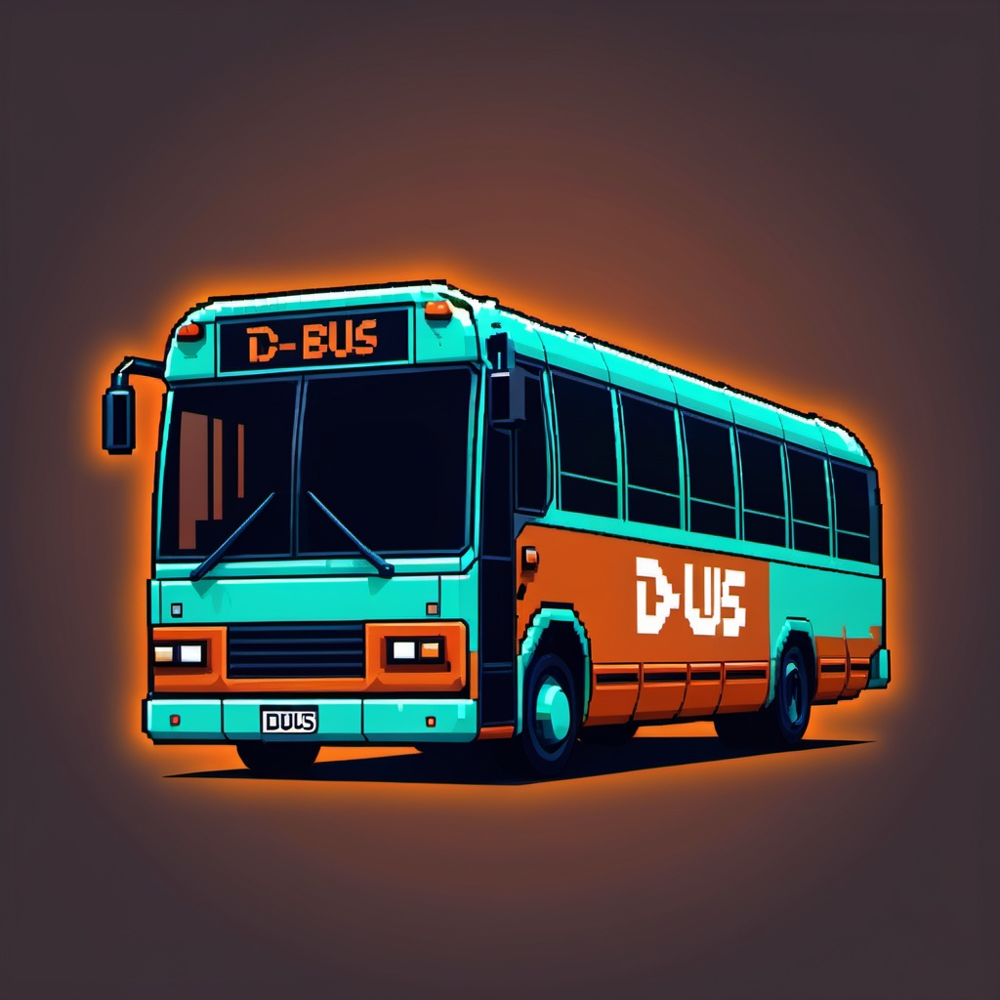
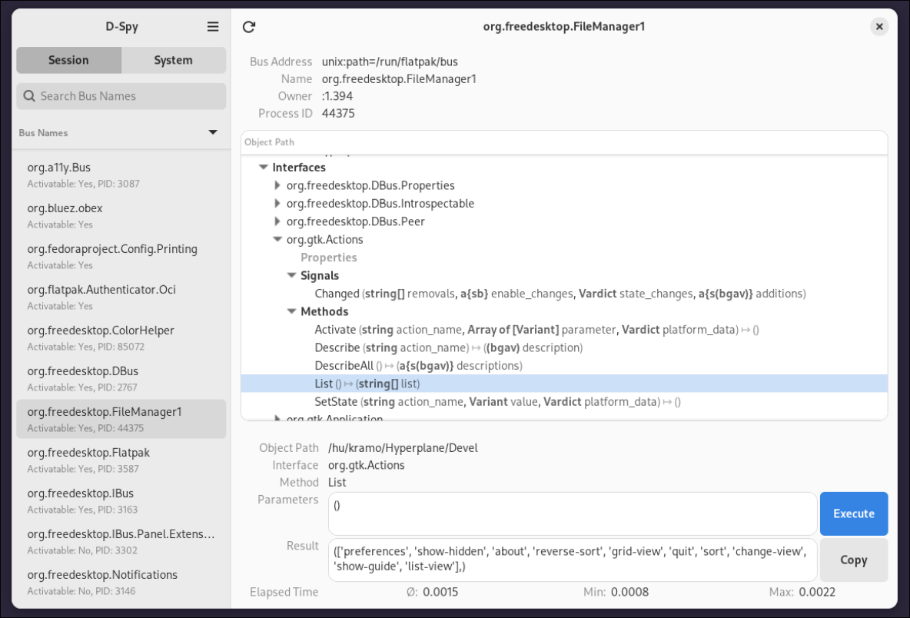

As I was learning about **Inter-Process Communication** ([IPC](https://en.wikipedia.org/wiki/Inter-process_communication)) in Linux, I stumbled upon the D-Bus. Released in 2006 by the [FreeDesktop](https://www.freedesktop.org/wiki/) project, D-Bus is a message bus system that allows communication between applications.

D-Bus was developed to simplify the process of IPC in Linux. It offers several advantages over other IPC methods:

- Standardized communication protocol
- Support for both synchronous and asynchronous communication
- Built-in security and access control
- Language-agnostic design

I wanted to explore how I could use D-Bus with Rust :crab: to send and receive messages between my processes and other applications.
With everything that is Linux, the documentation is not always the best. So I decided to write a very small and simple code sample to help others who are looking to use D-Bus in Rust.

### How does D-Bus work? :bus:

D-Bus works by abstracting the functionality of a process in a way that can easily be used by other applications to share functionalities and messages, regardless of the programming language used.
It uses a client-server model where applications can act as both clients and servers.

In a more OOP fashion, think of it as an interface that the process should implement. The process then subscribes to a channel, and other connected processes can call its methods.

D-Bus operates with **two main types of buses**:

1. **Session Bus**: Used for communication between user applications within a single user session.
2. **System Bus**: Used for system-wide communication, typically involving system services and privileged operations.

There is a very handy command that allows you to see all messages that are being sent and received on the D-Bus. You can run the following command in your terminal:

```fish
dbus-monitor --session
```

### Let's enter the bus shall we?

D-Bus was written originally in **C**, but there are bindings for other languages like Rust. In this guide, we will be using the `dbus` crate to interact with the D-Bus.

in your `Cargo.toml` file, add the following dependencies:

```toml
[dependencies]
dbus = "0.9.0"
```

or simply run the following command:

```fish
cargo add dbus
```

#### Create a connection

To create a connection a session connection, you can use the `Connection::new_session()` method.

```rust
use std::time::Duration;
use dbus::{self, blocking::BlockingSender};

fn main() -> Result<(), Box<dyn std::error::Error>> {
    let dbus_connection = dbus::blocking::Connection::new_session()
        .map_err(|e| format!("Failed to connect to D-Bus session bus: {}", e))?;

    println!("Successfully connected to D-Bus session bus");
    Ok(())
}

```

With just that, your process gains access to every service connected to the session bus, such as **Bluetooth**, **NetworkManager**, etc. Congratulations!

#### Querying a D-Bus service :mag:

By convention, D-Bus services implement a function called `Introspect` that returns an XML representation of the service's API.
This is useful to know what methods are available on the service. Let's query the D-Bus service itself to see what methods are available.

```rust
use std::time::Duration;
use dbus::{self, blocking::BlockingSender};

fn main() -> Result<(), Box<dyn std::error::Error>> {
    let dbus_connection = dbus::blocking::Connection::new_session()
        .map_err(|e| format!("Failed to connect to D-Bus session bus: {}", e))?;

    let introspect_message_dbus = dbus::message::Message::new_method_call(
        "org.freedesktop.DBus",
        "/org/freedesktop/DBus",
        "org.freedesktop.DBus.Introspectable",
        "Introspect",
    ).map_err(|e| format!("Failed to create D-Bus message: {}", e))?;

    let dbus_reply = dbus_connection
        .send_with_reply_and_block(introspect_message_dbus, Duration::new(1, 0))
        .map_err(|e| format!("Failed to send D-Bus message: {}", e))?
        .get_items();

    println!("D-Bus Introspection Result:");
    for item in dbus_reply {
        println!("{:?}", item);
    }

    Ok(())
}

```

Let's understand what we've just done here.

The `new_method_call` method creates a new message to be sent to the D-Bus.
The first argument is the **service name**, the second is the **object path**, the third is the **interface name**, and the last is the **method name**.

Then we send the message using the `send_with_reply_and_block` method.
The first argument is the **message to be sent** (here it's our `instrospect_message_dbus`) and the second is the **timeout duration**.

`get_items` method returns a vector of `MessageItem` that contains the response from the D-Bus service.
If we print the `dbus_reply`, we will see the XML representation of the D-Bus service.

The XML output from the Introspect method provides a detailed description of the D-Bus service's interface.
It includes information about available methods, signals, and properties. Here's a brief explanation of what you might see:

```xml
  ...
  <interface name="org.freedesktop.DBus.Introspectable">
    <method name="Introspect">
      <arg direction="out" type="s"/>
    </method>
  </interface>
  ...
```

- `<interface>`: Defines a D-Bus interface with a unique name.
- `<method>`: Represents a callable method on the interface.
- `<arg>`: Specifies arguments for the method. The direction attribute indicates whether it's an input ("in") or output ("out") argument.
- `type="s"`: Indicates the argument type, in this case, a string.

And with that, you know exactly how to query a D-Bus service using Rust. If you want to easily discover all of the service available, there is a wonderful GUI app called [d-spy](https://apps.gnome.org/en-GB/Dspy/) that you can use to explore the D-Bus.


Let's have some fun by making our process launching the color picker in KDE.

```Rust
use std::time::Duration;
use dbus::{self, blocking::BlockingSender};

fn main() {
    let connection = Connection::new_session()?;

    let message = Message::new_method_call(
        "org.kde.KWin",
        "/ColorPicker",
        "org.kde.kwin.ColorPicker",
        "pick",
    )?;

    let reply = connection.send_with_reply_and_block(message, Duration::from_secs(5))?;

    if let Some(color) = reply.get1::<u32>() {
        println!("Picked color: #{:08X}", color);
    } else {
        println!("Failed to retrieve color");
    }

    Ok(())
}
```

And that's it! You have successfully sent a message to the D-Bus service to launch the color picker in KDE.

### Conclusion

D-Bus is a powerful tool that allows you to communicate between processes in Linux.
With the dbus crate, you can easily interact with D-Bus using Rust. This guide has helped you get started, but there's much more to explore:

- Creating your own D-Bus services
- Handling asynchronous communication
- Working with D-Bus signals
- Implementing D-Bus properties

I hope this guide has given you a solid foundation for working with D-Bus in Rust. Happy coding! get started with D-Bus in Rust.

## Resources

## D-Bus API

- [Bus API](https://dbus.freedesktop.org/doc/api/html/group__DBusBus.html#ga8a9024c78c4ea89b6271f19dbc7861b2)
- [Connection API](https://dbus.freedesktop.org/doc/api/html/group__DBusConnection.html#ga8d6431f17a9e53c9446d87c2ba8409f0)
- [Error API](https://dbus.freedesktop.org/doc/api/html/group__DBusErrors.html#ga8937f0b7cdf8554fa6305158ce453fbe)
- [Message API](https://dbus.freedesktop.org/doc/api/html/group__DBusMessage.html#gad8953f53ceea7de81cde792e3edd0230)

## More Info

- [D-Bus Tutorial](https://dbus.freedesktop.org/doc/dbus-tutorial.html)
- [D-Bus Specification](https://dbus.freedesktop.org/doc/dbus-specification.html)
  - [Standard Interfaces](https://dbus.freedesktop.org/doc/dbus-specification.html#standard-interfaces)

## Other Examples

- [Using the D-Bus C API](http://www.matthew.ath.cx/misc/dbus)
- [Compiling D-Bus Programs](https://stackoverflow.com/questions/14263390/how-to-compile-a-basic-d-bus-glib-example)
